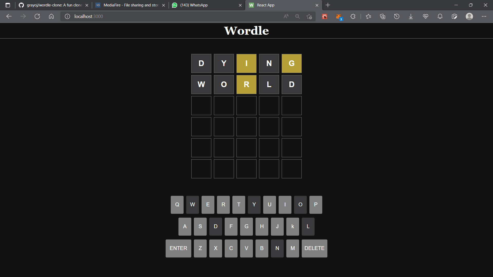

# Wordle Clone

This is a fun, simple wordle clone written in JavaScript & TypeScript. You can contribute, make pull requests, and improve the project if you wish.

# For JavaScript
The root directory, is the react-app version in the standard JavaScript and JSX file format and structure.

## Requirements

1. Node.js
2. Yarn
3. Wordle Bank (Already available)

## Installation

First Clone the repository, on you own local machine. By hitting
`git clone https://github.com/grayoj/wordle-clone.git `

Run `yarn add` to install dependencies that was used in the project

Run `yarn start` to boot up the application, in development mode

# For TypeScript

Still in development mode. Feel Free to make contributions. MIT License
